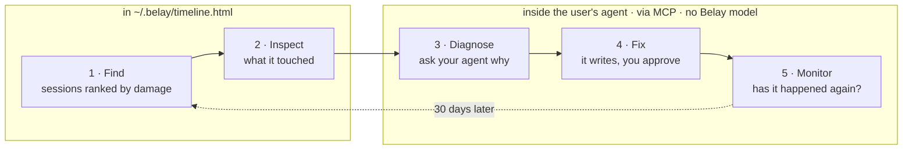
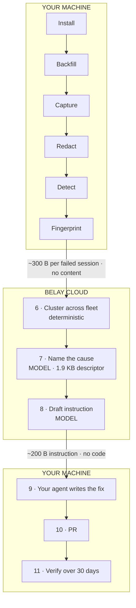

# Belay — engine

The endpoint binary, the local timeline, the MCP server, and (later) the fleet control plane.
This README is the plan of record as of **2026-09-07**. It captures the product and architecture
decisions made so far so the engine and the landing page don't drift apart.

Related: [`belay-landing-page`](https://github.com/DoplexLabs/belay-landing-page) — the public page
for the consumer tool. Its README lists every claim the page makes; the engine has to keep them true.

---

## 0. The thesis in one screen

**The situation.** Engineers run AI coding agents — Claude Code, Cursor, Codex, Copilot — on their
laptops. Those agents edit real files, run real commands, reach real hosts. Every record of that
lives as scattered session artifacts in harness-specific formats. Nobody can answer: *what did the
agent do, where did it fail, and why does it keep failing the same way?*

**The foundation.** [Numbat](https://github.com/perplexityai/numbat) — Perplexity's open-source
agent-visibility engine (Apache 2.0, released July 2026). One static Go binary, macOS/Linux/Windows,
amd64 + arm64. Three integration points: harness lifecycle hooks (including synchronous pre-action
hooks), on-disk session-artifact ingestion (reconstruction works for sessions from *before* install),
and an OTLP/HTTP receiver on `127.0.0.1:4318`. 26 harnesses. 52 detection rules across 11
categories, CEL rule engine, monitor-only by default, fails open. It is deliberately single-machine:
records go to stdout or local NDJSON, no server, no fleet view, no commercial roadmap from Perplexity.

**The product.** Everything Numbat chose not to build, in two tiers:

| | Belay for Consumers ("Solo") | Belay for Teams |
|---|---|---|
| Who | One developer, one machine | Eng lead at a 20–500-person AI-native company |
| Price | Free, forever | Self-serve, published per-seat pricing |
| Status | **Build now.** Launch gated on the binary existing. | **Waitlist only.** Not built. |
| Model | None. The user's own agent does the reasoning, via MCP. | One hosted call per *cluster*, BYOK optional |
| Network | Nothing leaves the machine | ~300 B fingerprint per failed session; ~1.9 KB per cluster |
| The job | Find the run that wasted your afternoon → fix it → confirm it didn't recur | The pattern across everyone's machines that no one can see alone |

**What we are not.** Not a security product (no prevention claims, no enforce mode — Numbat fails
open and so do we). Not LLM observability (Langfuse, LangSmith, Braintrust, Arize instrument code
*you wrote* via SDK; they structurally cannot see a third-party agent binary on a laptop — there is
nowhere to put the SDK). The sentence: *tracing tools watch the agents you built; we watch the agents
you bought, on the machines they actually run on.*

**What is actually sellable.** A dashboard has no verb. "Here's what your agents did" gets "huh,
interesting" and churns in month two. The product is *fixing agent failures*; observability is the
sensor. Every screen must end in an action and a number that moves.

**The principle that decides the design.** The installer and the buyer must want the same thing.
The engineer installs it because their agents start working better; the lead buys it because the
fleet's completion rate climbs. Anything that makes the tool an instrument for measuring engineers on
behalf of someone else gets uninstalled quietly, and we never learn why.

---

## 1. Belay for Consumers

### 1.1 Promises the product makes

These are on the public page. They are constraints on the engine, not marketing.

- **No account.** Not at install, not to see value, not ever for the free tier.
- **Nothing leaves the machine.** One binary, one folder (`~/.belay/`), one HTML file. No telemetry.
  Run it with the network off and it works identically. The falsifiable version of this claim is on
  the page, so it has to be true.
- **Belay has no model.** When the user asks "why did that run fail," their own agent reads the
  evidence through Belay's MCP tools and does the reasoning under the user's existing account.
  **Belay adds no new destination for data.**
- **Fails open.** A Belay crash never blocks a tool call. There is no mode where it does.
- **Never reads prompts.** Actions only — tools called, files touched, commands run, when the human
  stepped in. Prompts and completions stay wherever the harness keeps them.
- **Secrets are redacted before they're written**, using the engine's rules plus user patterns in
  `~/.belay/redact.yaml`. Redacted means gone, not hidden.
- **Pre-install reconstruction.** First run reads session artifacts already on disk and opens a
  timeline with weeks of history — before the user has done anything new. This is the single most
  important moment in the product; every design decision downstream protects it.
- **Free for one machine, forever.** No feature withheld to be discovered later.
- **Monitor means a count.** "0 recurrences in 30 days." Never a percentage for N=1.

### 1.2 The loop

Five steps. Two happen in a file on disk; three happen inside the agent the user already runs.



The target for step 5 is zero. The dashed edge is the retention mechanism — without it the free tool
is install → look once → forget.

### 1.3 Pipeline, stages 0–5 (all local, all deterministic)

| # | Stage | What happens | Network |
|---|---|---|---|
| 0 | **Install** | One command pulls a single Go binary: thin wrapper around a **pinned, unmodified** Numbat engine. Scans for harness config dirs (`~/.claude`, `~/.codex`, Cursor app support, …), writes lifecycle hooks into each, starts the local OTLP receiver, creates `~/.belay/events.ndjson`. | none |
| 1 | **Backfill** | Reads session artifacts already on disk and reconstructs them into the normalized event model. Target: install → "oh, *that's* what happened" in under two minutes. | none |
| 2 | **Capture** | Hooks fire on every agent action → one normalized event: `timestamp · session · harness · tool · target · exit`. Human interventions are events too — interrupts, mid-session corrections, approvals, denials. Appended to local NDJSON. | none |
| 3 | **Redact** | Secret patterns stripped on write. Engine rules + `~/.belay/redact.yaml`. | none |
| 4 | **Detect** | Rules, no model. See §1.4. | none |
| 5 | **Fingerprint** | Each failed session → a compact structured signature. See §1.5. In the consumer tier this stays local and feeds the MCP tools; in Teams it is the only per-session thing that ships. | none |

### 1.4 Detection rules (stage 4)

Deterministic. This *is* the free tier's analysis.

| Label | Rule |
|---|---|
| **failed** | non-zero exit, tests red, or dirty working tree at session end |
| **thrash** | same command with same exit code ≥ N times |
| **stall** | gap with no tool calls beyond threshold |
| **loop** | repeating tool shape, e.g. `Edit → Bash → Edit → Bash` |
| **false completion** | agent claimed done, verification (tests / tree) failed |
| **intervention** | human interrupted, corrected, approved or denied mid-session |

### 1.5 The fingerprint (stage 5)

Content is discarded; shape is kept. ~300 bytes.

```
path    src/middleware/auth.ts        edited ×4
cmd     "npm test -- auth"            exit 1 ×6
err     E7A3                          (normalized, hashed; truncated sample optional)
loop    Edit · Bash · Edit · Bash
human   at 9m40s · resolved after
```

Never in a fingerprint: prompts, completions, file contents, diffs, command stdout, credentials.
Strict mode additionally drops error samples and hashes paths.

### 1.6 The MCP server

Belay exposes session data as tools the user's agent can call. This is what turns the loop into a
conversation rather than a workflow, and it is the consumer tier's actual differentiator. **These
five names are on the public page.** Ship them, or change the page.

| Tool | Returns |
|---|---|
| `failed_sessions(limit, since?)` | sessions ranked by stalls / interventions / duration |
| `session_timeline(id)` | the event sequence with stall and intervention markers |
| `what_it_touched(id)` | files edited (with counts), commands run, hosts reached, what was left behind |
| `record_fix(session_id, label)` | persists a "watch" — the failure shape to monitor, the fix label, the start date |
| `recurrence_since(label)` | count of sessions matching that shape since the fix was recorded; the 30-day answer |

Implied storage: a small local store of fixes-being-watched, and a matcher for "same shape" against
new fingerprints. Cheap, but it must be in scope explicitly — the page promises it.

Reference interaction (from the landing page):

```
> why did that last session go so badly?
⏺ belay:failed_sessions(limit=1)
⏺ belay:session_timeline("s_8f31c2")
⏺ belay:what_it_touched("s_8f31c2")
⏺ Read src/middleware/auth.ts
  … agent explains its own mistake, proposes 4 lines for CLAUDE.md …
> yes
⏺ Edit CLAUDE.md  +4 lines
⏺ belay:record_fix("s_8f31c2", "CLAUDE.md: v3 token contract")

— 30 days later —
> has the auth thing happened again?
⏺ belay:recurrence_since("CLAUDE.md: v3 token contract")
  0 matching sessions in 30 days
```

### 1.7 The timeline file

`~/.belay/timeline.html`, regenerated locally. Three views, matching the three hero tabs on the page:

1. **Where it went wrong** — sessions ranked by stalls, loops, interventions. Worst at top.
2. **A session** — event timeline. Stalls get an amber stripe and a duration; interventions get a
   blue stripe with what the user said. Footer: files / hosts / commands touched.
3. **Your numbers** — sessions, completion rate, stalls, hands-on minutes (never dollars for an
   individual — nobody bills themselves).

Design mockups: `reference/01-first-run-mockup.html` in the landing-page repo.

### 1.8 Launch sequencing

1. Dogfood Numbat on our own machines first. Confirm the event stream actually supports stall
   detection, intervention capture and fingerprinting. The whole product rests on a ~6-week-old repo
   with an unverified contributor base — find out on day 2, not day 40.
2. Clear the name (Belay Technologies exists; USPTO classes 9/42; domains; GitHub/npm/PyPI).
3. Build stages 0–5 + the MCP server + the timeline file.
4. **Then** the landing page goes live. Developers don't join waitlists for CLIs — they install or
   leave. The page converts on a command, so the command has to work.

Distribution: Numbat's ~1,000 GitHub stargazers are a public list of people who care about exactly
this problem. Plus HN, r/ClaudeAI, YC companies in the 20–200 range.

No email capture anywhere in the consumer product. The only email on the page is the Teams waitlist.

---

## 2. Belay for Teams

**Status: waitlist.** Not built. Gated on consumer adoption. What follows is the design so the
consumer engine is built with it in mind — the event model, fingerprint format and fail-open
contract are shared.

### 2.1 What only a fleet can see

One developer over six weeks has maybe 30 failed sessions and no visible pattern. Across 34
machines the same fingerprint appears 187 times and becomes a nameable cause with a fix that stops
it for everyone at once. That is the entire Teams value proposition, and it is the reason clustering
must happen server-side.

### 2.2 The product screen

Not a dashboard. A diagnosis that ends in a pull request.

- **Verdict, first.** "29% of your agent runs fail. Three causes explain 78% of them." A gauge:
  completion 71% today → 84% projected, the recoverable band labeled in points and engineer-hours.
- **Ranked causes**, by engineer-hours lost. Each: what's happening, evidence sessions, a
  copy-pasteable fix (CLAUDE.md block / hook config / `.agentignore`), predicted delta, an "open PR"
  action.
- **A verified card** for a fix already applied: recurrence 19/wk → 3, completion 64% → 71%,
  *predicted +6, delivered +7*. Predicted-vs-delivered is shown on every recommendation. This closed
  loop is the retention mechanism and the proof; without it it's a smarter dashboard.
- **"Not yet explained"** stated openly: the share of failures that don't cluster. A diagnostic
  that claims total explanation gets caught in week two.

Failure taxonomy (from the research): specification 42% · coordination 37% · weak verification 21%.
Patterned failures are diagnosable; diagnosable failures are fixable.

Mockup: `reference/02-diagnosis-mockup.html` in the landing-page repo.

### 2.3 The full pipeline, stages 0–11

Nine of eleven stages run on the machine. Two things ever cross the network.



| # | Stage | Where | Detail |
|---|---|---|---|
| 0–5 | as §1.3 | local | identical engine; fingerprints ship instead of staying local |
| 6 | **Cluster** | server, no model | signatures grouped across the fleet by exact / near-exact fingerprint match. 536 failures → ~15 clusters. |
| 7 | **Root cause analysis** | **model** | input is one cluster *descriptor* — the aggregate, ~1.9 KB, never a transcript. Output: cause named, classified into the taxonomy, mechanism explained. |
| 8 | **Draft the fix instruction** | **model** | same call. Output is an *instruction*, not a file: "add a CLAUDE.md section documenting the v3 token contract, referencing the real signature of `verifyToken` in `src/middleware/auth.ts`." Plus predicted delta from the corpus. |
| 9 | **Generate the fix** | local, customer's agent | the instruction comes down; the customer's own Claude Code writes the actual block against the real repo. **Code never leaves the machine.** |
| 10 | **Verify** | local detect → server compare | cluster recurrence before/after the fix date; fleet completion rate; predicted vs delivered, published either way |
| 11 | **Corpus** | server | anonymized fingerprints + fix applied + measured delta, across customers. A new customer's cluster matching a known fingerprint → instant diagnosis with **no model call**, and a delta backed by N prior applications. **This is the moat.** |

Stage 7 is the only place a model reads anything. It reads per cluster, not per session: ~15 calls
per workspace per month. That is why AI cost is near zero and the ≥80% gross-margin target holds.
Do not let anyone build per-session analysis.

### 2.4 Data boundary — be precise in every sales call

| Crosses the network | Size | Frequency |
|---|---|---|
| Session fingerprint | ~300 B | once per *failed* session |
| Cluster descriptor → model | ~1.9 KB | once per cluster (~15/mo) |
| Fix instruction ← model | ~200 B | once per cluster |
| Prompts, completions, file contents, diffs, credentials, transcripts | **0 B** | never |

A 34-engineer fleet: ~193 KB/month, total. Show the payload — a tool that watches everything a
developer does should be the one product willing to open its own outbound request.

The consumer page says "nothing leaves your machine." The Teams product cannot say that. It says
"session transcripts, never" and shows the fingerprint. Don't blur the two.

### 2.5 Where the model runs

| Mode | Inference | What the control plane sees | For |
|---|---|---|---|
| **Hosted** (default) | our key | cluster descriptors | self-serve, live in ten minutes |
| **BYOK** | customer's Bedrock / Azure OpenAI / Vertex endpoint | cluster descriptors — **we still build them** | anyone with a DPA / residency requirement |
| **Strict** | no model at all | nothing | the genuinely air-gapped; output degrades to unnamed signature groups |

BYOK is data residency and billing control, **not zero-knowledge**. Claiming otherwise gets caught
by the first engineer who asks. Strict mode is the actual zero-knowledge answer, and the price is
that nothing gets named — which is exactly what the free consumer tool does. Clean ladder.

True on-prem/air-gapped is a regulated-enterprise requirement and not our ICP: our whole thesis is
that we don't sell where Zenity's and Palo Alto's cost of sale beats us. The ICP already sends its
entire codebase to Anthropic and Cursor daily; objecting to a 1.9 KB descriptor while doing that is
not a coherent position, and a prospect who raises it is usually not our prospect.

### 2.6 Buyer, pricing, gates

- **Buyer:** eng lead / platform at a 20–500-person AI-native company. Not the CISO.
- **Motion:** self-serve, published per-seat pricing, no sales call. Publishing the price is itself
  the differentiator — every funded incumbent is quote-only.
- **Tiers:** $0 individual · $X/seat team · $Y/seat with SSO/RBAC/extended retention.
- **Validation gates (from the PRFAQ):** 30 self-serve trials in 30 days · ≥10 weekly-active
  workspaces at day 30 · ≥5 paid conversions at day 60. Miss them → the thesis is wrong; that's a
  finding, not a failure.
- **Presell before building.** Standing rule: 2-week presell, paid interest only, first signed dollar
  picks the company. The three pitches to test on the same twenty calls: *(a)* "your agents fail the
  same four ways; completion rate up 10 points in 30 days" — the one we're betting on; *(b)* "the
  artifact your security questionnaire asks for" — most reliably sellable, but it's a security
  company; *(c)* "which of your 40 Cursor seats are worth renewing" — real budget, but it measures
  engineers for someone else and kills bottom-up install. Ask for a card, not a nod.

### 2.7 Suggested stack (Teams)

Optimize for shipping. Next.js on Vercel · Postgres (Neon / Supabase) — ClickHouse only when ingest
actually hurts · Clerk or WorkOS for auth · Stripe. The endpoint is the same Go wrapper as the
consumer tier with a workspace token and an upload path for fingerprints.

### 2.8 Act two: Backstop

Every incumbent's architecture terminates at block / kill / alert. Nobody's pitch ends with "and the
work still got finished." Backstop: failed or stalled task → classify (transient / capability /
authority / unknown) → route (retry / alternate agent / the customer's engineer, with full session
state) → resume → verify against the target system's observable state. Stage 9 above — routing an
instruction to a local agent and verifying the result — is its first primitive. Build investment is
gated on observed demand: intervention volume in customer dashboards. No date.

---

## 3. Cross-cutting decisions

### 3.1 Numbat dependency

- Vendored as a **pinned, unmodified** dependency behind our wrapper. All Doplex code is in the
  wrapper, the MCP server, the timeline, and (later) the server.
- **No upstream contributions** (decision 2026-09-07). Weekly upstream sync. Re-merge cost accepted.
- The wrapper isolates the engine: a swap or absorb is a contained project, not a rewrite.
- Risks accepted: ~6-week-old repo, ~1,000 stars, contributor base unverified, no confirmed external
  merged PRs.

### 3.2 Tripwires — check weekly

| Watch | Why it matters |
|---|---|
| Perplexity or an OSAA member (CrowdStrike, Cisco, Databricks, LangChain) ships a hosted Numbat control plane | **existential** — it is exactly the Teams product |
| Palo Alto ships Koi Agentic Endpoint Security as a free / self-serve tier, or adds harness pre-action hooks | compresses the endpoint wedge |
| WitnessAI or CrowdStrike wins the MSP / self-serve channel first | closes the down-market door |
| Datadog pushes AI Agents Console (measures agent ROI, has an agent on every machine already) toward developer endpoints | the real observability-side threat, more than Langfuse |
| Claude Code / Cursor emit first-class OpenTelemetry | anyone ingesting OTel gets our raw data for free — differentiation moves entirely to fingerprinting, clustering and the corpus |

### 3.3 Things that are architecture, not measurement

Every number in this document — 300 B, 1.9 KB, 15 calls/month, 147 sessions, 71%, 6m 41s — is a
design target from mockups, not a measured value. The real fingerprint size depends on how much
error-string context naming needs; whether failures cluster cleanly enough to name is the biggest
open technical question. Both are settleable only against a dogfood fleet. Hold them as targets
until week one produces real ones.

### 3.4 Open items

- [ ] Name clearance for "Belay"
- [ ] Dogfood: does Numbat's event stream actually support stall detection + intervention capture?
- [ ] Do failures cluster cleanly on one machine? Across a fleet?
- [ ] Fingerprint size vs. naming accuracy tradeoff (strict-mode cost)
- [ ] `record_fix` / `recurrence_since` shape-matcher design
- [ ] Pricing values ($X, $Y)
- [ ] Unit-economics model from dogfood event volume
- [ ] Teams waitlist backend (the landing-page form currently stores nothing)

---

## 4. Reference material

Design mockups live in the landing-page repo under `reference/`:

| File | Shows |
|---|---|
| `01-first-run-mockup.html` | consumer install terminal + local timeline file |
| `02-diagnosis-mockup.html` | Teams diagnosis screen — verdict, ranked causes, fixes, verified card, data boundary |
| `03-pipeline-mockup.html` | the eleven stages with every network crossing drawn |
| `04-landing-v1-archive.html` | the consumer page before the loop was added |

Source documents (internal, not in any repo): PRFAQ v3 (2026-09-07), competitive research
(2026-09-06), and the endpoint-first competitive dossier.
